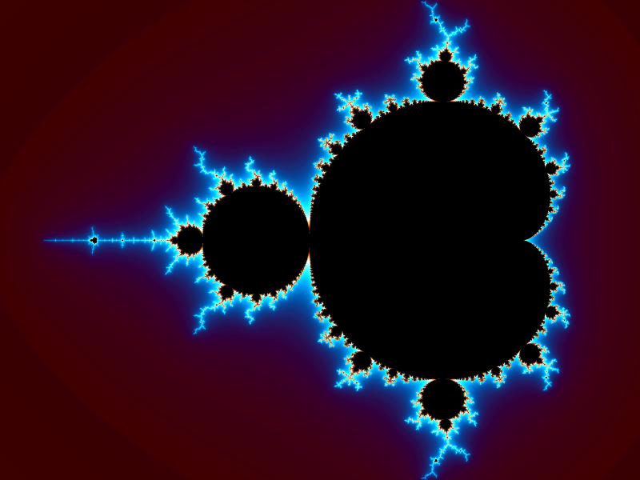
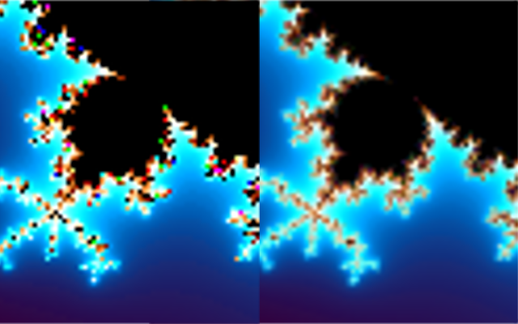

# Insula

Simple Multi-threaded Fractal Rendering program



## Usage

Use
```bash
Insula -h
```
to see the list of available command line arguments. These include:

1. `-o`: Output file. By default is equal to input file name appended with
	`.png`, to the current directory.
2. `-i`: Input file. Mandatory
3. `-t`: Number of Threads. The default (0) is equal to hardware concurrency.
4. `-b`: Bucket size: Chunk size for rendering an image.

The input file has the following format:
```json
{
	"type": "<Type>",
	"dimensions": [<Width>, <Height>],
	<objects...>
}
```

Note: All arguments except for `"type"` have default values. For example of
usage, see `doc/examples`.

### Types

1. `Test`: The best type to test out your gradients! Nothing needs to be
	specified.
2. `Mandelbrot`: Renders the Mandelbrot set. A Mandelbrot object must be
	supplied, which has the following format
```json
"Mandelbrot": {
	"centre": [<X>, <Y>],
	"radius": ...,
	"iterations": <Max-iterations>,
	"escapeRadius": <Max-radius>,
}
```

### Gradients

A gradient is a object that influences the drawing of other objects. It has
the format
```json
"gradient": {
	"nOut": <Number of Samples>,
	"colors": [
		<Control>, <R>, <G>, <B>, <A>,
		<Control>, <R>, <G>, <B>, <A>,
		...
	]
},
```
To improve performance, the gradient will be sampled uniformly with `nOut`
samples and the result will use linear interpolation.

Each color point in `colors` have 5 values within the range `[0,1]`: Control is
the independent variable, and `R,G,B,A` are the dependent variables.
Barycentric rational interpolation is used to interpolate the gradient.

### Sampler

There are two types of samplers available. To explicitly use a sampler, add
```json
"sampler": {
	"type": <Type>,
	...
}
```
1. "Simple": 1 sample/pixel sampler.
2. "Super": Several samples/pixel.
```json
"sampler": {
	"type": "Super",
	"spp": <Samples-per-pixel>,
	"seed": <Random-seed>
},
```


## Building

It is best to do an out of source build at `build/` directory. Create a
subdirectory `build` and execute
```
cd build
cmake .. -DCMAKE_BUILD_TYPE=Release
make
```

## Developing

#### Conventions and scripts

The source code is formatted according to the following astyle
configuration:
```
--style=allman
--align-pointer=type	
--close-templates
--convert-tabs
--indent-preproc-block
--indent-preproc-define
--indent=tab=2
--pad-header
--unpad-paren
```
